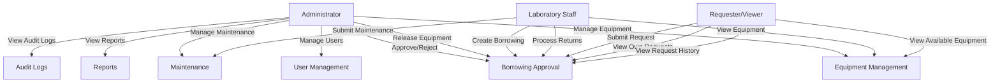
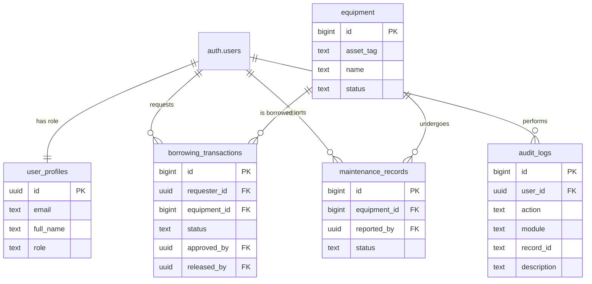
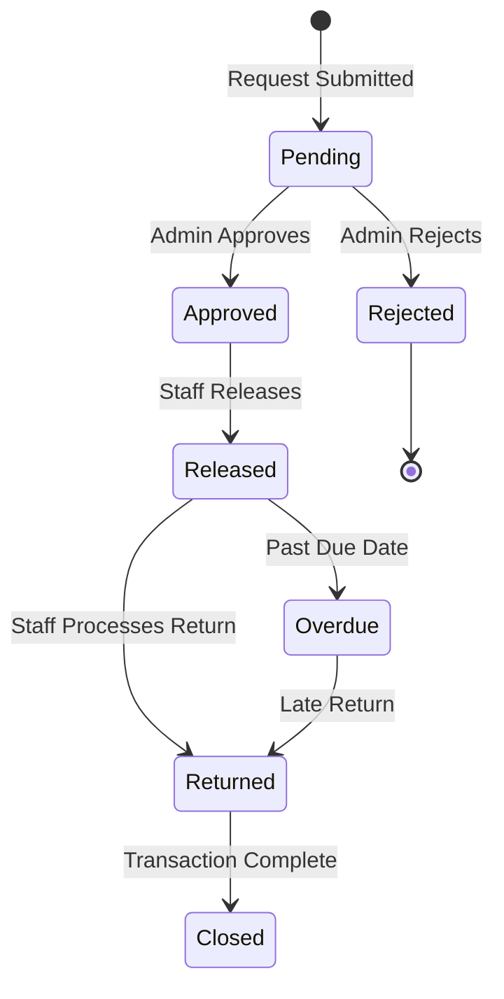

# Laboratory 4: Role-Based Asset Transaction and Approval Management

**Live Site:** https://ekoyslayer00.github.io/service-request-system/
**Repository:** https://github.com/ekoyslayer00/service-request-system

---

## Problem Statement
Extend the Laboratory 3 service request system into a **role-based asset management system** with approval workflows, business rule validation, and audit trail. The system enforces three user roles (Administrator, Laboratory Staff, Requester/Viewer) with database-level authorization via Supabase RLS and interface-level enforcement via JavaScript.

---

## User Roles & Use Case Diagram



---

## Entity-Relationship Diagram



---

## Workflow Diagram



---

## Role-Permission Matrix

| Function | Administrator | Laboratory Staff | Requester/Viewer |
|----------|:---:|:---:|:---:|
| Manage Users | ✅ | ❌ | ❌ |
| View Equipment | ✅ | ✅ | ✅ (Available only) |
| Manage Equipment (CRUD) | ✅ | ✅ | ❌ |
| Delete Equipment | ✅ | ❌ | ❌ |
| Create Borrowing Request | ✅ | ✅ | ✅ |
| Approve/Reject Requests | ✅ | ❌ | ❌ |
| Release Equipment | ✅ | ✅ | ❌ |
| Process Returns | ✅ | ✅ | ❌ |
| Manage Maintenance | ✅ | ✅ | ❌ |
| View Reports | ✅ | ❌ | ❌ |
| View Audit Logs | ✅ | ❌ | ❌ |
| View Own Requests | ✅ | ✅ | ✅ |
| View Request History | ✅ | ❌ | ✅ |

---

## Business Rules

| Rule ID | Description |
|---------|-------------|
| BR-A4-01 | Only available equipment may be requested |
| BR-A4-02 | Staff cannot approve their own request |
| BR-A4-03 | Only Administrator may approve or reject requests |
| BR-A4-04 | Only Approved requests may be released |
| BR-A4-05 | Released equipment becomes Borrowed |
| BR-A4-06 | Returned equipment becomes Available unless damaged |
| BR-A4-07 | Rejected requests cannot be released |
| BR-A4-08 | Returned transactions cannot be processed twice |
| BR-A4-09 | Equipment under Maintenance cannot be borrowed |
| BR-A4-10 | Sensitive operations must be logged |

---

## Audit Trail

The `audit_logs` table records all critical operations:

| Column | Description |
|--------|-------------|
| `id` | Primary key |
| `user_id` | UUID of user who performed the action |
| `user_email` | Email of user (denormalized) |
| `action` | CREATED, UPDATED, DELETED, APPROVED, REJECTED, RELEASED, RETURNED, LOGIN, LOGOUT, etc. |
| `module` | Equipment, Borrowing, Maintenance, Users, Auth |
| `record_id` | ID of the affected record |
| `description` | Human-readable description |
| `created_at` | Timestamp |

**Example entry:**
```
User: admin@services.com
Action: APPROVED
Module: Borrowing
Record ID: 102
Description: Approved borrowing request #102
```

---

## SQL Script (RLS Policies)

```sql
-- See full SQL in the repository's SQL setup
-- Key tables: user_profiles, equipment, borrowing_transactions, maintenance_records, audit_logs

-- Helper function
CREATE OR REPLACE FUNCTION public.get_user_role()
RETURNS TEXT AS $$
  SELECT role FROM public.user_profiles WHERE id = auth.uid();
$$ LANGUAGE SQL SECURITY DEFINER STABLE;

-- RLS enabled on all tables
-- Policies for role-based access at database level
```

---

## Functional Test Results (TC-A4-01 to TC-A4-10)

| Test ID | Scenario | Expected Result | Status |
|---------|----------|-----------------|--------|
| TC-A4-01 | Viewer attempts to open Admin page | Access denied | ✅ PASS |
| TC-A4-02 | Staff submits request | Request saved as Pending | ✅ PASS |
| TC-A4-03 | Administrator approves request | Status = Approved + audit log created | ✅ PASS |
| TC-A4-04 | Administrator rejects request | Status = Rejected | ✅ PASS |
| TC-A4-05 | Attempt to release rejected request | Operation blocked | ✅ PASS |
| TC-A4-06 | Release approved equipment | Equipment = Borrowed | ✅ PASS |
| TC-A4-07 | Return released equipment | Equipment = Available | ✅ PASS |
| TC-A4-08 | Check audit log after approval | Approval entry visible | ✅ PASS |
| TC-A4-09 | Staff attempts restricted delete | Operation blocked | ✅ PASS |
| TC-A4-10 | Logout and open protected page | Redirected to login | ✅ PASS |

---

## Role-Specific Navigation

### Administrator
```
Dashboard | Users | Equipment | Borrowing Requests | Maintenance | Reports | Audit Logs | Logout
```

### Laboratory Staff
```
Dashboard | Equipment | Borrowing | Returns | Maintenance | Logout
```

### Requester / Viewer
```
Dashboard | Available Equipment | My Requests | Request History | Logout
```

---

## Tech Stack

- **Frontend:** Vanilla HTML, CSS, JavaScript (ES Modules)
- **Backend:** Supabase (PostgreSQL + Auth + RLS)
- **Hosting:** GitHub Pages

---

## Test Credentials (for evaluation)

| Role | Email | Password |
|------|-------|----------|
| Administrator | admin@services.com | (provided separately) |
| Laboratory Staff | staff@services.com | (provided separately) |
| Requester | requester@services.com | (provided separately) |
